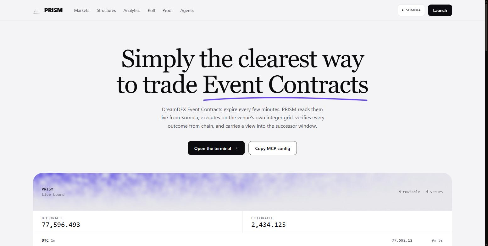
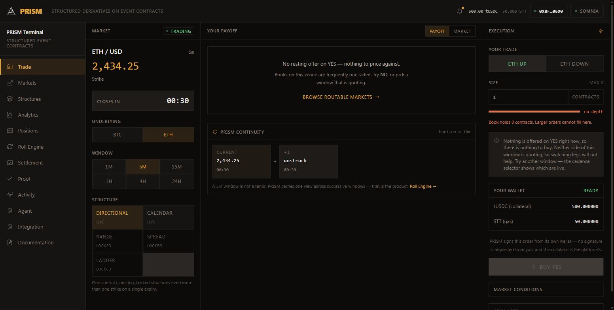
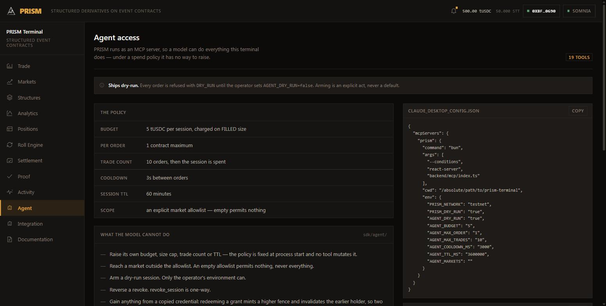

# PRISM

[](https://github.com/Venkat5599/somnai/actions/workflows/ci.yml)

**Strategy infrastructure for DreamDEX Event Contracts.**

DreamDEX Event Contracts expire every few minutes. PRISM turns those ephemeral
contracts into positions with a real tenor — reading live markets from Somnia,
executing against them, verifying the result independently of the SDK, settling
them, and carrying a view into the successor window.

```
EVENT CONTRACT → STRATEGY → RISK → EXECUTION → VERIFICATION → SETTLEMENT → CONTINUITY
```

- **Live demo** — [prism-terminal-cyan.vercel.app](https://prism-terminal-cyan.vercel.app)
- **On-chain proof** — [/proof](https://prism-terminal-cyan.vercel.app/proof), re-read from chain on every request
- **Network** — Somnia Shannon testnet (chain `50312`)




<p align="center">
  
  
</p>

<p align="center">
  <em>The terminal, and the agent surface. Both read the same live registry.</em>
</p>

---

## The problem

An Event Contract is a cash-or-nothing digital: it pays 1 tUSDC if the
underlying finishes above a strike at window close, 0 otherwise. A real
derivatives primitive.

It is also **extremely short-lived**. Routable windows are minutes long, and the
venue does not pre-strike successors — measured across all twelve live chains,
every one reported *no successor listed* for seventeen minutes straight. A
trader wanting exposure beyond one window must rediscover, re-strike and
re-enter continuously, by hand, forever.

PRISM exists to remove that.

## Why DreamDEX specifically

The venue lists **one strike per window** and five cadences per asset. That kills
composition across strike — no ladder, no Range, no Spread, no risk-neutral
density — and makes composition across **time** the only real axis. PRISM is
built on the axis the venue actually has, not the one a generic options UI
assumes.

---

## What is real

Everything below executes against Somnia and is independently verifiable.
**There is no simulated data anywhere in this repository.**

| Capability | Evidence |
|---|---|
| Market discovery | 554 binary markets from the Somnia indexer, every underlying it lists |
| Normalization | `UnifiedMarket` → typed `EventMarket` at one boundary, with every discarded row counted by reason |
| Routability | struck / unstruck / expired / inside-headroom, from chain fields |
| Oracle prices | live BTC & ETH from Somnia's on-chain EMA feed |
| OHLC candles | real 1m/1h/1d, charted with TradingView's `lightweight-charts` |
| **Execution** | signed, mined, verified — [tx](https://shannon-explorer.somnia.network/tx/0xd6f0a3e2831b5fdea150e9d026234f9dfc5bd62e33064510117e114f9ffef65e) |
| **Settlement** | finalized sweep, fee-aware payout, real redeem |
| **Verification** | outcome re-derived from receipt, nonce and balance delta |
| **Non-custodial signing** | RainbowKit — users sign with their own key |
| Roll planner + daemon | real succession chains, typed blockers |
| Wallet history | read from the Shannon explorer account API |

### 50-tx on-chain batch — Aug 30, 2026

Operator burner `0xc27C4fBadF1B22C83C075104EC7d1D3360c1c31E` distributed
**0.9 STT in each of 50 mined transactions** to the testnet cohort wallet set.
Every hash below was re-verified against the Shannon explorer (from/to/value,
receipt success) after mining — no row is claimed from memory.

| # | Transaction hash | Explorer | Value | Status |
|---|------------------|----------|-------|--------|
| 1 | `0xca74793c072edbcfe598b0961bd0db68ac9943029286c74fc65af86bf4ca102c` | [view](https://shannon-explorer.somnia.network/tx/0xca74793c072edbcfe598b0961bd0db68ac9943029286c74fc65af86bf4ca102c) | 0.9 STT | success |
| 2 | `0x6fe0a090a710b15f38164e1df963e66f4d929e0927c3ab8e32638df14b1df5f1` | [view](https://shannon-explorer.somnia.network/tx/0x6fe0a090a710b15f38164e1df963e66f4d929e0927c3ab8e32638df14b1df5f1) | 0.9 STT | success |
| 3 | `0x7a8977e5cbadcd92dbd86815d42fabbaa2045c3d748528d94ad5ae1b63ea3d3a` | [view](https://shannon-explorer.somnia.network/tx/0x7a8977e5cbadcd92dbd86815d42fabbaa2045c3d748528d94ad5ae1b63ea3d3a) | 0.9 STT | success |
| 4 | `0xb14cd57fbfa743d301ef20f5887c072b8edc52a1e01fdaf5c2a0cda6c8dad4dd` | [view](https://shannon-explorer.somnia.network/tx/0xb14cd57fbfa743d301ef20f5887c072b8edc52a1e01fdaf5c2a0cda6c8dad4dd) | 0.9 STT | success |
| 5 | `0x848ff837e7c8b456736e36aef5aa62f04c7d186308a0ccd215a1d6ac641ef852` | [view](https://shannon-explorer.somnia.network/tx/0x848ff837e7c8b456736e36aef5aa62f04c7d186308a0ccd215a1d6ac641ef852) | 0.9 STT | success |
| 6 | `0x4da93fde8b500ac8e9dcd1b719c4c128bb6d94e96263c6a7079ea55ab2512c01` | [view](https://shannon-explorer.somnia.network/tx/0x4da93fde8b500ac8e9dcd1b719c4c128bb6d94e96263c6a7079ea55ab2512c01) | 0.9 STT | success |
| 7 | `0x11c16d93ea9e972300482ddd5b423d3ecc28af46d832125cb1d4db8ac07c38ec` | [view](https://shannon-explorer.somnia.network/tx/0x11c16d93ea9e972300482ddd5b423d3ecc28af46d832125cb1d4db8ac07c38ec) | 0.9 STT | success |
| 8 | `0x0e5739c399b1a4921c912af7271902a37677a507d52e4723e18293bb2a2a2ebe` | [view](https://shannon-explorer.somnia.network/tx/0x0e5739c399b1a4921c912af7271902a37677a507d52e4723e18293bb2a2a2ebe) | 0.9 STT | success |
| 9 | `0xe96f0137157e40c9b5e8d9c66a0bd360e8544f3c4eed10a6ec4554f36d102d08` | [view](https://shannon-explorer.somnia.network/tx/0xe96f0137157e40c9b5e8d9c66a0bd360e8544f3c4eed10a6ec4554f36d102d08) | 0.9 STT | success |
| 10 | `0x47bf82caf36a801cbaef46d5505eaf6059ea58cc755845309124d64633a44837` | [view](https://shannon-explorer.somnia.network/tx/0x47bf82caf36a801cbaef46d5505eaf6059ea58cc755845309124d64633a44837) | 0.9 STT | success |
| 11 | `0x6ef3170a44552c3f3e0fb8e1ccecf474ff78d2d166d36637ac0b9028ee01f66a` | [view](https://shannon-explorer.somnia.network/tx/0x6ef3170a44552c3f3e0fb8e1ccecf474ff78d2d166d36637ac0b9028ee01f66a) | 0.9 STT | success |
| 12 | `0x4625afcae6517bea83b1bce7eac9025133aefd58078ee49bd5de69656c580642` | [view](https://shannon-explorer.somnia.network/tx/0x4625afcae6517bea83b1bce7eac9025133aefd58078ee49bd5de69656c580642) | 0.9 STT | success |
| 13 | `0x1534bdd16a2ce20d090133a489517c86d1baa99ec517f2cc7107508ba303f128` | [view](https://shannon-explorer.somnia.network/tx/0x1534bdd16a2ce20d090133a489517c86d1baa99ec517f2cc7107508ba303f128) | 0.9 STT | success |
| 14 | `0x50dad22e8ff6a20576e0c34395dd7bfe3cb9824db0ddb215521cb293ba0bad08` | [view](https://shannon-explorer.somnia.network/tx/0x50dad22e8ff6a20576e0c34395dd7bfe3cb9824db0ddb215521cb293ba0bad08) | 0.9 STT | success |
| 15 | `0x44f3aa170c82274473c553f89a360572277a4da8f75fd014c2a0451e73afd531` | [view](https://shannon-explorer.somnia.network/tx/0x44f3aa170c82274473c553f89a360572277a4da8f75fd014c2a0451e73afd531) | 0.9 STT | success |
| 16 | `0xd65400fa3f65a3805ef6110ea0b94073df8ef47543298189b4220b817aabe756` | [view](https://shannon-explorer.somnia.network/tx/0xd65400fa3f65a3805ef6110ea0b94073df8ef47543298189b4220b817aabe756) | 0.9 STT | success |
| 17 | `0xa380ac5b91b182ca13ea530b7d72d8a769752a851ac89b8e802eb85d0e9c40cb` | [view](https://shannon-explorer.somnia.network/tx/0xa380ac5b91b182ca13ea530b7d72d8a769752a851ac89b8e802eb85d0e9c40cb) | 0.9 STT | success |
| 18 | `0x06660283ef8961956c12f8e45a96840d331893ce2c808e9656e2d37db3cc29ee` | [view](https://shannon-explorer.somnia.network/tx/0x06660283ef8961956c12f8e45a96840d331893ce2c808e9656e2d37db3cc29ee) | 0.9 STT | success |
| 19 | `0xc9e8b7cadab6cd2d5160425bc241c8d0e35754770990ef85897e86cf2c20fce1` | [view](https://shannon-explorer.somnia.network/tx/0xc9e8b7cadab6cd2d5160425bc241c8d0e35754770990ef85897e86cf2c20fce1) | 0.9 STT | success |
| 20 | `0xd2c04e0879d039873c68ce65630f5864c7c16ca8463d6355b64075decda80d5d` | [view](https://shannon-explorer.somnia.network/tx/0xd2c04e0879d039873c68ce65630f5864c7c16ca8463d6355b64075decda80d5d) | 0.9 STT | success |
| 21 | `0xe506612276fc2d80878929132c52f0298cde3a65d1fa850c3eff599e232a8a30` | [view](https://shannon-explorer.somnia.network/tx/0xe506612276fc2d80878929132c52f0298cde3a65d1fa850c3eff599e232a8a30) | 0.9 STT | success |
| 22 | `0xe4e4e684423a4d5579d5fe80642ac18370871ba5c937c227ada64599ce9dea3b` | [view](https://shannon-explorer.somnia.network/tx/0xe4e4e684423a4d5579d5fe80642ac18370871ba5c937c227ada64599ce9dea3b) | 0.9 STT | success |
| 23 | `0x19d2d118e002a26a29ff7a02abeef059f62a4fd4f0dde319665cf616ca7cedc4` | [view](https://shannon-explorer.somnia.network/tx/0x19d2d118e002a26a29ff7a02abeef059f62a4fd4f0dde319665cf616ca7cedc4) | 0.9 STT | success |
| 24 | `0xd74008bd9776e86e87348c4e8f5b97b9d8d41ddb0c49b66e9b7c51bed0dea85c` | [view](https://shannon-explorer.somnia.network/tx/0xd74008bd9776e86e87348c4e8f5b97b9d8d41ddb0c49b66e9b7c51bed0dea85c) | 0.9 STT | success |
| 25 | `0x5bb87ac41c2743e04cb4d76008d25126730138124481be7ceb4770aa47981a34` | [view](https://shannon-explorer.somnia.network/tx/0x5bb87ac41c2743e04cb4d76008d25126730138124481be7ceb4770aa47981a34) | 0.9 STT | success |
| 26 | `0x6fd4be71c07a1fddffd5a46160bd586eb2f599fd190faee5eeba550b438928e3` | [view](https://shannon-explorer.somnia.network/tx/0x6fd4be71c07a1fddffd5a46160bd586eb2f599fd190faee5eeba550b438928e3) | 0.9 STT | success |
| 27 | `0xc36e0d16e7561443b1c4713041f3a9c3fd8f84fe8afa7d7e6f8c157fdb1d135a` | [view](https://shannon-explorer.somnia.network/tx/0xc36e0d16e7561443b1c4713041f3a9c3fd8f84fe8afa7d7e6f8c157fdb1d135a) | 0.9 STT | success |
| 28 | `0x5b9c19bed4f706d062b474499a8737f997c37339389ef8d56c2b68495ac0b4fe` | [view](https://shannon-explorer.somnia.network/tx/0x5b9c19bed4f706d062b474499a8737f997c37339389ef8d56c2b68495ac0b4fe) | 0.9 STT | success |
| 29 | `0x1089bb23eeed8f70f5e55c4c6d8233ddee4e47add2693e996305aea873353e30` | [view](https://shannon-explorer.somnia.network/tx/0x1089bb23eeed8f70f5e55c4c6d8233ddee4e47add2693e996305aea873353e30) | 0.9 STT | success |
| 30 | `0xe902ff6d2836efe60b49b4e0ed81ddc62e2f30743a0a0e2db9c739cde11ed189` | [view](https://shannon-explorer.somnia.network/tx/0xe902ff6d2836efe60b49b4e0ed81ddc62e2f30743a0a0e2db9c739cde11ed189) | 0.9 STT | success |
| 31 | `0x703b3685f60026db805c363e773014725d8120adc1fc3e2e9c6196f28873f901` | [view](https://shannon-explorer.somnia.network/tx/0x703b3685f60026db805c363e773014725d8120adc1fc3e2e9c6196f28873f901) | 0.9 STT | success |
| 32 | `0x8ccaec91089aa13113b4ef691aed1d085ab51eb812d1844c600ecdecc247cfaf` | [view](https://shannon-explorer.somnia.network/tx/0x8ccaec91089aa13113b4ef691aed1d085ab51eb812d1844c600ecdecc247cfaf) | 0.9 STT | success |
| 33 | `0x6f33cb10f359d9c4f739c85d7ba238d6f085046c5869262353f825d20662277f` | [view](https://shannon-explorer.somnia.network/tx/0x6f33cb10f359d9c4f739c85d7ba238d6f085046c5869262353f825d20662277f) | 0.9 STT | success |
| 34 | `0x41f04039282e34a7b15825b390a5998e8b5efc098a5c3f7209a5c753beaccf05` | [view](https://shannon-explorer.somnia.network/tx/0x41f04039282e34a7b15825b390a5998e8b5efc098a5c3f7209a5c753beaccf05) | 0.9 STT | success |
| 35 | `0xa3139d4658d271af29c4f810fe55aa4a81b2d47ed46c45e3ef540dcf1910df82` | [view](https://shannon-explorer.somnia.network/tx/0xa3139d4658d271af29c4f810fe55aa4a81b2d47ed46c45e3ef540dcf1910df82) | 0.9 STT | success |
| 36 | `0x5aeac1b01930ade96a03169b140235194689e01fa10c6ee77272f12212a477af` | [view](https://shannon-explorer.somnia.network/tx/0x5aeac1b01930ade96a03169b140235194689e01fa10c6ee77272f12212a477af) | 0.9 STT | success |
| 37 | `0xd40cbbc8820a5d8ff3c8ea3c6550f1380761d735a64ef0aaae3c567fe8355cb8` | [view](https://shannon-explorer.somnia.network/tx/0xd40cbbc8820a5d8ff3c8ea3c6550f1380761d735a64ef0aaae3c567fe8355cb8) | 0.9 STT | success |
| 38 | `0x1c4aab968f35545dbef921d38b8c1ecc01d66e06629e1caffb2ec10db73388f1` | [view](https://shannon-explorer.somnia.network/tx/0x1c4aab968f35545dbef921d38b8c1ecc01d66e06629e1caffb2ec10db73388f1) | 0.9 STT | success |
| 39 | `0xf4f1c4b978385c03547c149821fe7aea5fe57ad35cd440c4c47b43d6846fe915` | [view](https://shannon-explorer.somnia.network/tx/0xf4f1c4b978385c03547c149821fe7aea5fe57ad35cd440c4c47b43d6846fe915) | 0.9 STT | success |
| 40 | `0x21583f2e0916c5a18f773a5eedacba6787a8fb08a9c0ffd033ffc619d40e2b69` | [view](https://shannon-explorer.somnia.network/tx/0x21583f2e0916c5a18f773a5eedacba6787a8fb08a9c0ffd033ffc619d40e2b69) | 0.9 STT | success |
| 41 | `0x55c6f2e0924929a993b0f0bf68c3056f51d22688f38de137a927a6adf05284a9` | [view](https://shannon-explorer.somnia.network/tx/0x55c6f2e0924929a993b0f0bf68c3056f51d22688f38de137a927a6adf05284a9) | 0.9 STT | success |
| 42 | `0x0382897c647c66f4264d57b77142027c10f32558be336a2b6dcdf22054b4bd25` | [view](https://shannon-explorer.somnia.network/tx/0x0382897c647c66f4264d57b77142027c10f32558be336a2b6dcdf22054b4bd25) | 0.9 STT | success |
| 43 | `0x8ae0f7b63aed5221f0443343cd75d1032c7c35fce6e0673d1cfdcaf57f81df10` | [view](https://shannon-explorer.somnia.network/tx/0x8ae0f7b63aed5221f0443343cd75d1032c7c35fce6e0673d1cfdcaf57f81df10) | 0.9 STT | success |
| 44 | `0x679ffaee4744f332151bcd9131a92fe49cf3132b9d3172c753a8b675dde433ae` | [view](https://shannon-explorer.somnia.network/tx/0x679ffaee4744f332151bcd9131a92fe49cf3132b9d3172c753a8b675dde433ae) | 0.9 STT | success |
| 45 | `0xd5e60763b1ea130369d19a781b07f9b205a7f1106bc1a4f24deb84cbea61646e` | [view](https://shannon-explorer.somnia.network/tx/0xd5e60763b1ea130369d19a781b07f9b205a7f1106bc1a4f24deb84cbea61646e) | 0.9 STT | success |
| 46 | `0xcd474d3991378c55178640e66f596a891f674a7139b7e2b1546c2be845aa1b57` | [view](https://shannon-explorer.somnia.network/tx/0xcd474d3991378c55178640e66f596a891f674a7139b7e2b1546c2be845aa1b57) | 0.9 STT | success |
| 47 | `0x3ab69fe5161b1f6e2a98f0458d0958a5b621dcf2b4cae8b8db80f3936999b2a2` | [view](https://shannon-explorer.somnia.network/tx/0x3ab69fe5161b1f6e2a98f0458d0958a5b621dcf2b4cae8b8db80f3936999b2a2) | 0.9 STT | success |
| 48 | `0x4d17500147705a02d09d3e6ff0d550a7b16c6efbfef1fa1f60bf32b34761a88e` | [view](https://shannon-explorer.somnia.network/tx/0x4d17500147705a02d09d3e6ff0d550a7b16c6efbfef1fa1f60bf32b34761a88e) | 0.9 STT | success |
| 49 | `0x1377bead2336a6c230e12741c0ee79f7ea11d540c3d3ae0fa766480f26e99e1d` | [view](https://shannon-explorer.somnia.network/tx/0x1377bead2336a6c230e12741c0ee79f7ea11d540c3d3ae0fa766480f26e99e1d) | 0.9 STT | success |
| 50 | `0x25283861c76f9d5f7096aceb46a592d2c2ad496e56b96899278e32bb5d816d75` | [view](https://shannon-explorer.somnia.network/tx/0x25283861c76f9d5f7096aceb46a592d2c2ad496e56b96899278e32bb5d816d75) | 0.9 STT | success |

### Venue constraints, and what we built around them

Three things every generic options UI assumes turned out not to hold here. Each
was checked against the chain rather than assumed, each is **probed at runtime**
rather than asserted, and each has real engineering behind it — so the product
tracks the venue instead of describing a venue that does not exist.

**Atomic multi-leg batching: the chain cannot do it, so we built the next best
guarantee.** EIP-7702 ships in Prague, and Shannon is pre-Prague.
It carries none of Prague's system contracts
(`0x…2935`, `0x…7002`), nor Cancun's beacon-roots contract, and its block
headers have no `withdrawalsRoot`, `excessBlobGas` or `requestsHash`. Probing
by transaction envelope is useless here — the node answers a malformed type-`0x2`,
a type-`0x4` and a nonexistent type-`0x7f` with the identical
`invalid transaction / 0x08`, verified against a negative control — so
[`sdk/venue/capabilities.ts`](sdk/venue/capabilities.ts) detects the fork by
system-contract presence instead.

In its place, [`sdk/dreamdex/batch.ts`](sdk/dreamdex/batch.ts) delivers the
guarantee 7702 was wanted for, as far as this chain allows:

| | |
|---|---|
| `PREFLIGHT_ALL_OR_NOTHING` | every leg gated before a signature exists — nothing is sent |
| `SEQUENTIAL_VERIFIED` | every leg filled, each verdict read from its own receipt |
| `PARTIAL_UNWOUND` | a leg failed; the filled legs were sold back and the sale verified |
| `PARTIAL_EXPOSED` | a leg failed **and** an unwind failed — read this one |

Legs go out `FILL_OR_KILL`, so a leg either exists whole or not at all and an
unwind never faces a partial. **This is not atomic**: between the first fill and
the unwind there is a real window in which the position is one-sided.

It is driven from **Basket** on [`/structures`](https://prism-terminal-cyan.vercel.app/structures)
— pick two to four routable legs, price them, open them — and the panel renders
the raw `atomicity` field, never a boolean and never a green tick. `PARTIAL_EXPOSED`
is styled to be impossible to skim past, because it means size is still on and
the reader has to act.

**A capability module with no caller now fails the build.**
`tests/deploy-config.test.ts` walks the tree for real `from "…"` clauses and
fails any module nothing imports — typecheck, tests and the build otherwise all
pass happily on a library nobody calls. `tests/batch.test.ts` asserts the
grading function never overstates a guarantee, including the case where the
unwind loop dies part-way and a naive "every unwind succeeded" check would
report flat while a leg is still open.

**Range / Spread / Ladder: the venue cannot express them, and the UI proves it
from live data.**
Each needs 2+ strikes on one expiry. Re-verified live while writing this: across
**548 markets**, the most distinct strikes on any single expiry is **1**. This is
no longer a paragraph — [`sdk/venue/structures.ts`](sdk/venue/structures.ts)
decides it from the registry, `/structures` and `/docs` print the counts they
were decided from, and `tests/structures.test.ts` asserts the verdict *flips* the
day a second strike appears.

**The roll: built, verified, and waiting on the venue to list a successor.**
The planner and daemon share the verified execution path. What was missing is a
successor: the venue does not pre-strike them, so the window in which one exists,
is struck and has a resting offer is short and unpredictable.
[`scripts/roll-watch.ts`](scripts/roll-watch.ts) was a parallel implementation —
it hard-coded the tick grid and read the SDK's own receipt field as the verdict,
so a success there proved nothing about PRISM. It now calls `planRoll` /
`executeRoll` directly, sits on the venue for as long as you tell it to, and
writes `docs/evidence/roll-receipt.json` on a chain-verified roll.

```bash
PRISM_DRY_RUN=false ROLL_WATCH_MINUTES=120 \
  bun --conditions react-server scripts/roll-watch.ts
```

**Measured, not assumed.** A receipt is written only on a verified roll, so an
empty `docs/evidence/` would not distinguish *the venue never listed a
successor* from *nobody ran the watcher*. Every sweep therefore appends one
timestamped line to
`docs/evidence/roll-observations.jsonl` whether or not anything was rollable, and
`scripts/probe-succession.ts` prints a machine-readable verdict on demand. Last
run: `NO_SUCCESSOR_LISTED`, `exact:NO label:NO` on every live market — so neither
the exact-seconds match nor the venue's own cadence label finds one, which places
the absence at the venue rather than in `successionChain`.

---

## The verified round trip

```
buy     0xd6f0a3e2831b5fdea150e9d026234f9dfc5bd62e33064510117e114f9ffef65e
        1 YES at 0.886 tUSDC
        market resolved YES
redeem  0x1b21a41150cd019ca1fdc1472f416563de7e3a6158499e4b1844aa0cfc793206
        block 471,513,467 · receipt 0x1

tUSDC   499.114000 → 500.114000            net +0.114000
```

[`/proof`](https://prism-terminal-cyan.vercel.app/proof) re-reads both
transactions from Somnia on every request — receipt status, block, sender, and
the collateral movement **decoded from the transfer logs**. Only the two hashes
are constants. If the chain stopped agreeing, the page would say so.

---

## Architecture

```
                        User
                          |
              +-----------+-----------+
              v                       v
     Wallet (RainbowKit)        PRISM web (Vercel)
     user's own key                   |
              |                       v
              |            backend/market-data     no key -> scales out
              |            backend/executor        SINGLE WRITER, one key
              |            backend/roll            the daemon
              |                       |
              +-----------+-----------+
                          v
                       sdk/
              venue/ · dreamdex/ · quant
                          |
              @somnia-chain/markets-sdk
                          |
                   Somnia Shannon
                          |
              VERIFICATION: raw RPC, independent of the SDK
                          |
                  Shannon explorer
```

```
backend/executor/     owns the key — serialized queue
backend/market-data/  read fan-out — no key
backend/roll/         the roll + claim daemon
contracts/            addresses + ABIs of the contracts PRISM calls
sdk/                  venue, dreamdex, quant — shared, React-free
src/                  the Next.js app
docs/                 architecture · gotchas · demo
tests/                195 tests
```

`contracts/` documents the DreamDEX contracts PRISM *talks to* — addresses,
ABIs, and the transactions that verified each one. **PRISM deploys none of
them**; it is a client. See [`contracts/README.md`](contracts/README.md).

---

## Two signing paths

| | Custody | Nonce | Ceiling |
|---|---|---|---|
| **Wallet connected** | user's key | user's own | none |
| Demo burner | server key, guarded | one shared | ~1 tx globally |

Nonces are sequential, so a single server key means every trade in the system
contends for one nonce. Connecting a wallet removes that entirely.

The split of responsibility matters:

- **Server owns the arithmetic.** Price and size snap to the venue's integer
  tick and lot grid before anything reaches the browser, so a float never
  reaches an 18-decimal venue. That must not depend on the client.
- **Client owns the key.** It receives `to`, `data`, `value` and signs. No
  private material crosses the boundary in either direction.

The SDK **returns** the approval and never sends it — skipping it reverts
on-chain — so it is sent first and awaited before the order.

---

## Why the SDK response is not the truth

The DreamDEX bot kit documents that a write **can resolve without throwing even
when the transaction reverted**. A `success` flag is therefore evidence, not a
verdict.

`verifyExecution()` never reads it. It re-derives the outcome from chain via raw
RPC:

1. `eth_getTransactionReceipt` — authoritative when a hash exists
2. `eth_getTransactionCount` — nonce movement proves something was broadcast
3. `balanceOf(tUSDC)` — a real delta proves collateral moved

It may answer **`UNKNOWN`**, and the UI renders `UNKNOWN` as `UNKNOWN`. An
explorer link is built only from a hash that survived verification.

---

## Performance

Measured, before and after:

```
getMarketSnapshot()   1245-4876ms, uncached, on EVERY page render
                      -> ~50k GraphQL queries at 50k users

/markets   req 1  5.996s   (cold)
           req 6  0.053s   (cached)          112x
/trade     1.120s -> 0.452s
/roll      817 KB -> 104 KB
```

Registry pulls at 50k users: **~6/min**, not 50,000. TTLs are set against how
fast the data can change — windows are minutes long, so a 10s-stale registry is
still correct, and countdowns tick client-side from the snapshot's own
`fetchedAt` so a cached snapshot shows a *correct* clock.

Never cached: anything that signs, and anything per-wallet. A stale balance is a
wrong trade.

---

## Security

- No key ever reaches the browser; `.env*` is gitignored and CI scans full
  history for key literals
- `server-only` on every module that can move funds
- Rate limit per caller, plus an **on-chain spend floor** that holds across
  serverless instances where in-memory limits cannot
- Server-side order size cap — a limit that only exists in an input's `max`
  attribute is not a limit
- Mandatory order expiry, capped at the market's own
- IOC by default, so no remainder rests with escrow locked

---

## Testing

```
tests/quant.test.ts         payoff boundaries, PAVA repair, depth limits
tests/grid.test.ts          reproduces the 18-decimal bug, then proves the fix
tests/routability.test.ts   expiry headroom, struck/unstruck, status gating
tests/structures.test.ts    the one-strike constraint, AND that it flips
tests/batch.test.ts         the grading function, incl. the unwind-died case
tests/deploy-config.test.ts tracing root, route coverage, no uncalled modules
tests/discovery.test.ts     a THIRD underlying survives normalization
tests/wallet-config.test.ts no placeholder credential reaches the relay
tests/bot-kit.test.ts       the kit's six strategy names, and the Builder's
```

195 tests, all pure — no mocked blockchain. Live behaviour is verified manually
against Shannon and recorded above; that is stated separately rather than dressed
up as integration coverage.

The grid tests matter most: the 18-decimal failure is **invisible on a 6-decimal
testnet**, so a happy-path test would pass against broken code. They assert the
failure first.

`structures.test.ts` is the second-most important, for the opposite reason. It is
easy to write a test that agrees the venue has one strike; the useful assertions
are the ones proving Range and Spread turn **on** at two strikes and Ladder at
three. A constraint that can only ever answer "no" is indistinguishable from a
hard-coded no.

---

## dreamBot Builder configs

The [dreamBot Builder](https://dreambot-builder.vercel.app) is Somnia's no-code
front end for the bot kit. Walking it end to end, it emits exactly one artifact
— a `.env` block — and tells you to run it against the kit:

```
NETWORK=testnet
DRY_RUN=true
STRATEGY=ec-starter
PRIVATE_KEY=0x...
TAKE_MAX_SHARES=5
TAKE_MAX_POSITION=20
TAKE_INTERVAL_MS=8000
```

PRISM runs that same config against **its own** execution path, so the config
stays portable while the execution stays verified — the grid-safe integer tier,
and an outcome re-derived from the receipt rather than the SDK's return value,
which is precisely what the kit documents can lie.

```bash
cp bot.env.example bot.env      # or paste the Builder's block
bun run svc:bot bot.env
```

**The key is deliberately not read from the config.** The Builder's block
carries a `PRIVATE_KEY` line; the parser reports only whether a usable key is
*present* and never carries its value — a config object gets logged and
serialised into errors. PRISM reads the key from its own environment, in the one
place that already does.

| Kit `STRATEGY` | Builder label | PRISM | runner |
|---|---|---|---|
| `ec-starter` | EC Starter | crosses the spread on the verified IOC path | `runStarter` |
| `ec-settlement` | EC Settlement | `findClaimable` + fee-aware `claim` | `runSettlement` |
| `ec-maker` | EC Market Maker | post-only bid and ask around fair, re-quoted as it moves | `runQuoting` |
| `ec-passive` | EC Passive Bid | one post-only bid, never pays the spread | `runQuoting` |
| `ec-laddering-bot` | EC Ladder | post-only grid each side, flattened inside expiry headroom | `runQuoting` |
| `ec-oracle-follow` | — | takes the side Somnia's EMA oracle implies, past an edge threshold | `runOracleFollow` |

**All six run, under either spelling.** The left column is the kit's own
`STRATEGY` value; the middle is the Builder's UI label. PRISM used to accept
*only* the middle column, so a config carrying the kit's documented
`STRATEGY=ec-maker` was rejected with "not an Event Contracts strategy" — an
integration that claimed to run the kit's strategies while refusing three of its
names. Both parse now; `canonicalStrategy` is the single place they map.

`ec-oracle-follow` was missing outright, and the sentence here used to read "all
five run" about a set of six. The list had been transcribed from the Builder's
dropdown and never compared to anything — the same defect as the `INTERVALS` and
`KNOWN_VENUE_IDS` constants. [`scripts/probe-bot-kit.ts`](scripts/probe-bot-kit.ts)
now reads the kit's own docs from GitHub and exits non-zero if PRISM's list has
drifted in either direction; `tests/bot-kit.test.ts` is the offline half.

The kit documents that `ec-oracle-follow` needs an underlying spot price and
**exits at startup on mainnet** unless you wire an external ticker. PRISM reads
Somnia's on-chain EMA oracle — the feed these contracts actually settle against,
not a correlated third-party ticker — so on testnet it follows the settlement
source itself. The mainnet limitation is the kit's, and is printed at startup
rather than papered over. The three resting ones were refused until PRISM had
**order cancellation** — each must *manage* a quote after placing it, and a
post-only order that can never be pulled leaves escrow locked in a market that
settles, which the bot kit calls the easiest way to lose track of collateral.

[`sdk/dreamdex/cancel.ts`](sdk/dreamdex/cancel.ts) closed that: `cancelOrder` /
`cancelOrders` through the raw trader tier, with **what is still resting re-read
from chain** rather than inferred from a receipt — a green receipt says the
transaction executed, not that every id in it was pulled, and the batch call
skips stale ids silently. Open orders come from `getOwnOpenOrdersOnchain`, not
the indexer, whose order view lags chain head; cancelling against a lagged list
means believing you are flat while a quote is still resting.

Three rules the quote loop enforces, each one a way to lose money quietly:

- **Flatten inside the expiry headroom**, and on `SIGINT`. A quote outliving its
  window is escrow locked in a settled market — and `loadMarkets` drops
  finalized markets, so it is hard to even find again.
- **Cancel before re-quoting, and abort if anything survives.** Placing on top
  of orders you failed to pull is how a maker ends up on both sides of its own
  book.
- **Only re-quote when fair moved at least half a tick.** Below that the
  replacement snaps to the same on-grid price, so it spends two nonces to arrive
  where it already was.

The quote maths is pure and tested in [`tests/quotes.test.ts`](tests/quotes.test.ts)
— a maker that computes a crossed pair does not throw, it rests, and the venue
takes whichever side is free money.


---

## Agents

An agent can do everything the terminal does. It just cannot spend more than you
let it.

```bash
bun run svc:mcp                 # stdio — what Claude Desktop connects to
MCP_HTTP_TOKEN=<32+> bun run svc:mcp-http   # HTTP, for hosting
```

Nineteen tools: read the registry, price a book, plan and execute a roll, open a
multi-leg structure, cancel resting orders, claim settlement, re-verify the
proof. There is also a plain TypeScript client in
[`sdk/agent/client.ts`](sdk/agent/client.ts) for anyone who would rather embed
PRISM than adopt a protocol — MCP is a transport over that surface, not a second
implementation of it.

### The guardrails are a module, not checks at the call sites

An agent calls tools in a loop, and a limit written where it is used is a limit
the next tool forgets. [`sdk/agent/policy.ts`](sdk/agent/policy.ts) owns every
spend decision and the ledger of what has been spent; the write paths have no
other route to the executor, so a tool that forgets to ask simply cannot spend.

| | |
|---|---|
| Budget | per session, charged on **filled** size, never requested size |
| Per order | contract cap |
| Trade count | orders, then the session is spent |
| Cooldown | between orders |
| Scope | an explicit market allowlist |
| Default | dry-run — arming is an act by the operator, never the model |

Two of those are less obvious than they look, and both are tested:

**An empty allowlist permits nothing, never everything.** That is the difference
between a scoping bug and an unscoped agent.

**A `NaN` size is refused before any comparison runs.** NaN is neither above nor
below a bound, so an unchecked one passes every cap at once — it is the single
input that would defeat the whole policy.

Dry-run is checked **last**, so a refusal still names the real blocker. An
operator testing a policy learns it is broken before arming it, not after.

### Credentials a copy cannot use

Stated narrowly, because the loose version is marketing: there is no enclave
here and the credential file can be copied. What it cannot be is *used twice*.

Redeeming a grant mints a fence — a strictly increasing integer — and rewrites
the lease. Every write presents the current fence. A second process redeeming
the same grant mints a higher one and takes the lease, so the first is
invalidated and finds out on its next write rather than quietly double-trading
against one budget. Clone-ineffective and clone-evident, which is the honest
version of the claim.

The hmac covers the budget, the caps and the allowlist, so a copied grant cannot
be edited into a larger one without the operator's secret. And a grant only ever
*narrows*: `clampToGrant` takes the minimum of each cap and the intersection of
the allowlists.

### Try it

```bash
bun --conditions react-server scripts/agent-demo.ts   # the SDK, live
node scripts/mcp-demo.mjs                             # the MCP server, live
```

Both print a transcript rather than a claim. Neither signs anything — the
session is dry-run, so the refusals are the part worth reading.


---

## Why this grows the venue

Event Contracts have a structural problem that is not a liquidity problem: a
contract that expires in five minutes has no holding period, so there is no
reason to come back tomorrow. Every measurement below was taken from the live
venue while writing this.

**The cadence is faster than humans trade.** A five-minute window means twelve
decisions an hour, per market, forever. Nobody sits at that. The venue's own
board shows the consequence — of 14 live windows, 10 were unstruck and 0 were
routable at the moment of measurement. Depth is thin because attention is thin.

**Agents do not have that limit, and that is the whole thesis.** PRISM ships as
an MCP server and a TypeScript client, so any Claude user is one paste away from
trading DreamDEX, and any developer can embed the venue without learning it.
Nineteen tools, a spend policy the model cannot raise, and dry-run by default —
which is what makes it safe to hand to strangers rather than a liability.

**The roll converts a five-minute contract into a position.** Carrying a view
across window succession is what turns a one-time click into a returning
trader — and returning traders are the only kind that compound volume. That is
the product, not the ladder.

**Makers create the depth the board is missing.** All six bot-kit strategies run
on PRISM's verified path, three of them resting — maker, passive bid, ladder.
More makers is more depth, and more depth is what makes the venue tradeable for
everyone who arrives after.

### Revenue, natively

DreamDEX's own `placeOrder` carries `address builder` and
`uint96 builderFeeBpsTimes1k`. The venue already pays whoever routes the flow —
no token, no separate protocol, no rent extracted from users:

```solidity
function placeOrder(
  bool isBid, uint64 userData, uint256 price, uint256 quantity,
  uint64 expireTimestampNs, uint8 orderType, uint8 selfMatchingOption,
  address builder, uint96 builderFeeBpsTimes1k
) external payable returns (bool success, uint128 orderId);
```

So the incentives point the same way for everyone. PRISM earns when it routes
volume, DreamDEX earns when volume exists, and a trader pays a venue fee they
would pay anyway. A terminal, an agent surface and a fleet of makers are three
ways of feeding the same order book — which is why this is a business rather
than a demo.

### What would have to be true

Stated as conditions rather than promises, because the honest version is more
useful than an optimistic one:

| | |
|---|---|
| Agents actually trade | the surface exists and is verified; nobody has run one at scale |
| Successors get pre-struck | the roll is built and waiting — 0 successors in ~300 recorded sweeps |
| Mainnet behaves like testnet | the 18-decimal grid work exists *because* it will not |
| Makers find it worth quoting | fee capture is native; the spread has to cover it |

---

## Local development

```bash
bun install
cp .env.example .env.local
bun run dev                    # http://localhost:3177
```

```bash
bun run typecheck
bun run test
bun run build

bun run svc:market-data        # :8082  no key
bun run svc:executor           # :8081  needs PRIVATE_KEY
bun run svc:roll               # the daemon
docker compose up              # all three
```

Live diagnostics:

```bash
bun scripts/probe-venue.mjs        # discovery + venue scoping
bun scripts/probe-exec.ts          # balances, order book (places NO order)
bun --conditions react-server scripts/verify-markets.ts
```

## Environment

Names only; never commit values.

| Variable | Purpose |
|---|---|
| `PRISM_NETWORK` | `testnet` or `mainnet` |
| `PRISM_INDEXER_URL` | GraphQL indexer — **not** the RPC url |
| `PRISM_RPC_URL` | Somnia JSON-RPC |
| `PRISM_DRY_RUN` | `true` blocks all signing; only `false` arms it |
| `PRIVATE_KEY` | demo signer. Burner holding testnet value only |
| `PRISM_MAX_ORDER_CONTRACTS` | server-side per-order cap |
| `PRISM_RESERVE` | collateral floor for the shared demo wallet |
| `NEXT_PUBLIC_WALLETCONNECT_PROJECT_ID` | optional; injected wallets work without it |

> The indexer URL is a different host from the RPC. Passing the RPC where the
> indexer belongs fails with `RegistryMarkets failed: empty response`, which
> reads like an outage rather than a config mistake.

---

## Venue behaviour we design around

Eight gotchas, each **reproduced live** rather than cited — one strike per
window, `loadMarkets` hiding your winnings, the 18-decimal float bug, silent
reverts, unstruck successors, taker-pays-fill. See
[`docs/gotchas.md`](docs/gotchas.md).

## Further reading

- [`docs/architecture.md`](docs/architecture.md) — the read/write split
- [`docs/gotchas.md`](docs/gotchas.md) — venue behaviour, reproduced
- [`docs/demo.md`](docs/demo.md) — 2:30 script
- [`docs/worklog.md`](docs/worklog.md) — what changed and why, with the evidence

---

## Stack

Next.js 15 · React 19 · TypeScript (strict) · Tailwind v4 ·
`@somnia-chain/markets-sdk` · viem · wagmi · RainbowKit · lightweight-charts ·
Geist Mono · Vitest · Bun · Docker

---

*Testnet build. Educational reference, not financial advice.*
